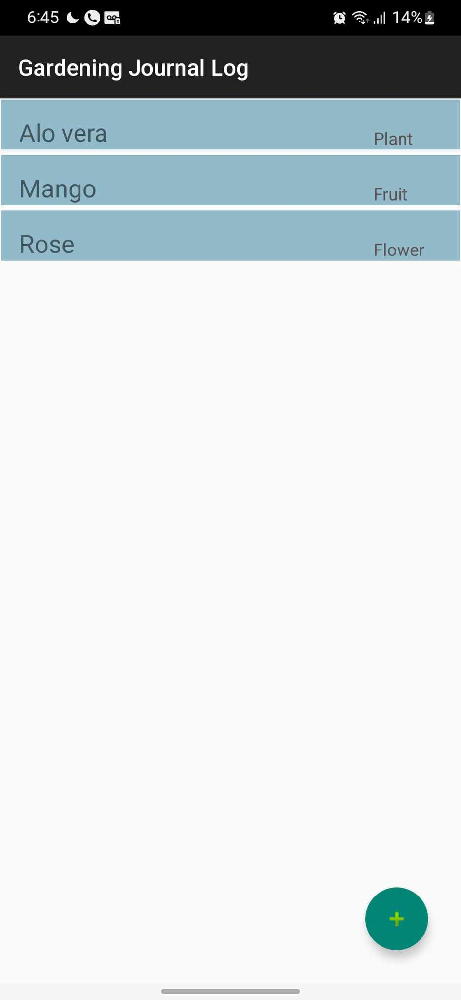
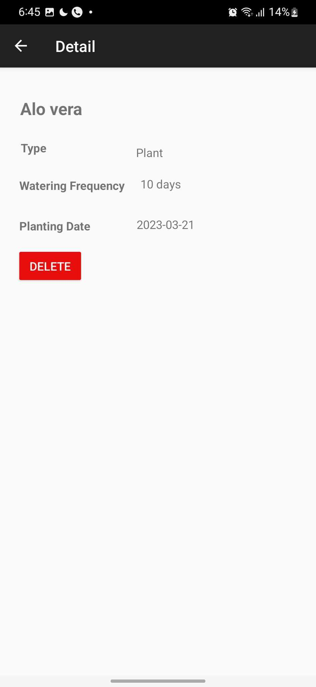
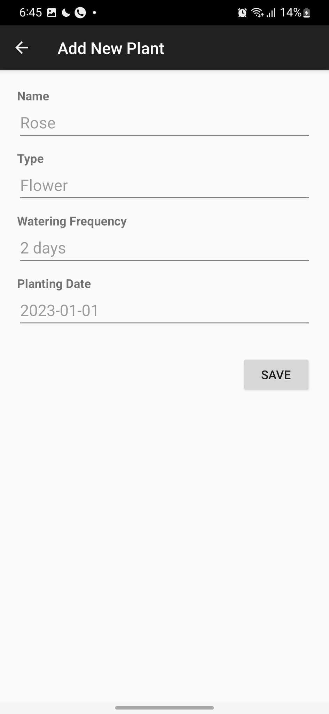

### CS473 Mobile Device Programming
#### Gardening Journal App

### About

The Gardening Journal App, developed in Kotlin for Android, features a well-structured navigation system with three main screens: Garden Log, Add New Plant and Plant Details, facilitated by the Navigation component and NavHostFragment. The app incorporates a Room database to store and retrieve plant information, utilizing a DAO for database operations. Coroutines are employed for asynchronous tasks, enhancing responsiveness, with a specific focus on the Garden Log screen where a RecyclerView displays plant data from the Room database, and users can seamlessly add new plants through coroutine-managed asynchronous database insertions. Overall, the app provides a user-friendly and efficient platform for managing gardening-related data.

### Running the App

1. Install Kotlin
2. Build the project using the command `./gradlew build`
3. Run the project using IDE's "Run" or "Debug" functionality.

### ScreenShots

